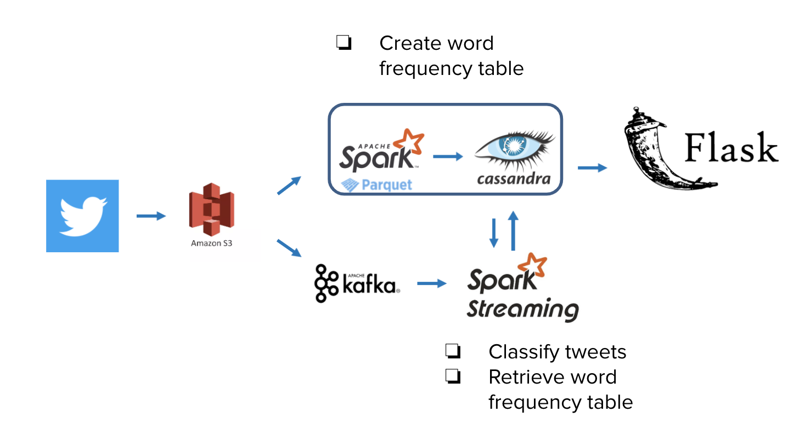

# TwitterTrend

Tracking trends using Twitter data.

presentation can be found in [Slide](https://docs.google.com/presentation/d/1KMZ27E4pJcsRUExlu292wBSVKz9gHooAM62EcEVWJGA)


## Introduction
Twitter is the most used microblog social media platform, which people talks about various topics. This project will help business to prioritize their ad bidding strategies by providing them insights about topics people are talking about and which users are most influential in those topics.
## Architecture

## Dataset
* Twitter archive from [here](https://archive.org/search.php?query=collection%3Atwitterstream&sort=-publicdate)

## How to install and get it up and running
* Instances
   * Spark - 4 $\times$ c5.xlarge for streaming,4 $\times$ m5a.xlarge for batch processing 
   * Kafka - 3 $\times$ i3.large
   * Cassandra - 3 $\times$ m4.large
   * Frontend - t2.micro

See the [setup](./setup/) folder detailed configurations.
* How to run
  * Batch processing
    ```
    nohup spark-submit --conf spark.sql.extensions=com.datastax.spark.connector.CassandraSparkExtensions --conf spark.hadoop.fs.s3a.endpoint=s3.ap-northeaazonaws.com --conf spark.executor.extraJavaOptions=-Dcom.amazonaws.services.s3.enableV4=true --conf spark.driver.extraJavaOptions=-Dcom.amazonaws.services.s3.enableV4=true --conf spark.hadoop.fs.s3a.aws.credentials.provider=com.amazonaws.auth.InstanceProfileCredentialsProvider --packages "org.apache.hadoop:hadoop-aws:2.7.3,com.datastax.spark:spark-cassandra-connector_2.11:2.4.3" batch_processing.py &
    ```
  * Streaming
    ```
    spark-submit --conf spark.sql.extensions=com.datastax.spark.connector.CassandraSparkExtensions --packages com.datastax.spark:spark-cassandra-connector_2.11:2.4.3,org.apache.spark:spark-streaming-kafka-0-8_2.11:2.4.1 spark_streaming.py
    ```
  * Kafka
    * Create topic `twitter` using `bin/kafka-topics.sh`
    * Run producer
      ```
      python3 twitter_producer.py
      ```

## Engineering challenges
see the [slide](https://docs.google.com/presentation/d/1KMZ27E4pJcsRUExlu292wBSVKz9gHooAM62EcEVWJGA) for more details.

[comment]: <> (## Trade-offs)
